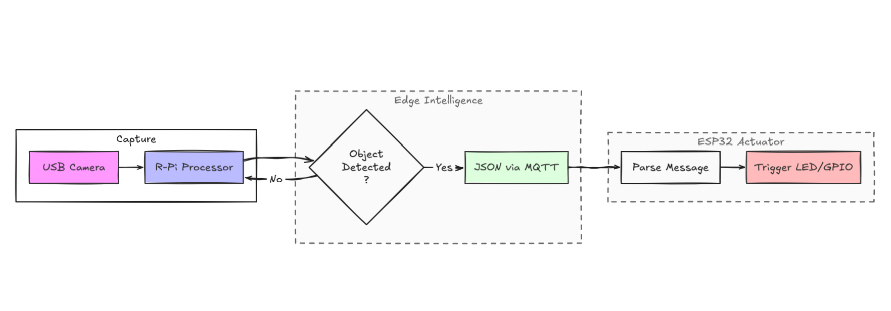

# 📡 EdgeVision: Raspberry Pi Object Detection with ESP32 Alert System

Real-time object detection system running on Raspberry Pi that triggers hardware alerts on an ESP32 via MQTT when a specific object is detected.

---

## 🚀 Overview
This project demonstrates an edge AI + IoT pipeline where a Raspberry Pi performs real-time object detection using a USB camera. When a predefined object is detected, a message is sent via MQTT to an ESP32 which triggers an LED alert.

---

## 🧠 Key Features
- Real-time object detection
- MQTT-based communication
- ESP32 hardware alert (LED)
- Edge AI processing (no cloud required)

---

## 🏗️ Architecture



---

## ⚙️ Setup
```bash
## Download Model

cd models

wget https://github.com/chuanqi305/MobileNet-SSD/raw/master/MobileNetSSD_deploy.caffemodel
wget https://github.com/chuanqi305/MobileNet-SSD/raw/master/MobileNetSSD_deploy.prototxt

pip install -r requirements.txt
python src/detector.py
```

---

## 🔌 MQTT Setup
```bash
sudo apt update
sudo apt install mosquitto mosquitto-clients
sudo systemctl enable mosquitto
sudo systemctl start mosquitto
```

---

## 🔧 ESP32
- Open esp32/led_control.ino in Arduino IDE
- Install required libraries (WiFi, PubSubClient)

- Update:
    WiFi credentials,
    MQTT broker IP,
    Topic name

- Upload code to ESP32.


---

## ⚡ Workflow
Camera → Raspberry Pi → Detection → MQTT → ESP32 → LED

## ⚡ How It Works
1. Camera captures live video feed
2. Model processes each frame in real time
3. If target object is detected:
   - MQTT message is published
5. ESP32 receives the message and:
   - Blinks LED as an alert

---

## 🔮 Future Improvements
🔔 Add buzzer or multiple output devices
📱 Mobile notifications (via cloud integration)
📊 Dashboard for monitoring detections
🧠 Custom-trained object detection model
☁️ Cloud logging and analytics

---

📌 Use Cases
Smart surveillance systems
Industrial monitoring
Smart home automation
Object-triggered alert systems

## 📌 Author
Kojo Denkyi
